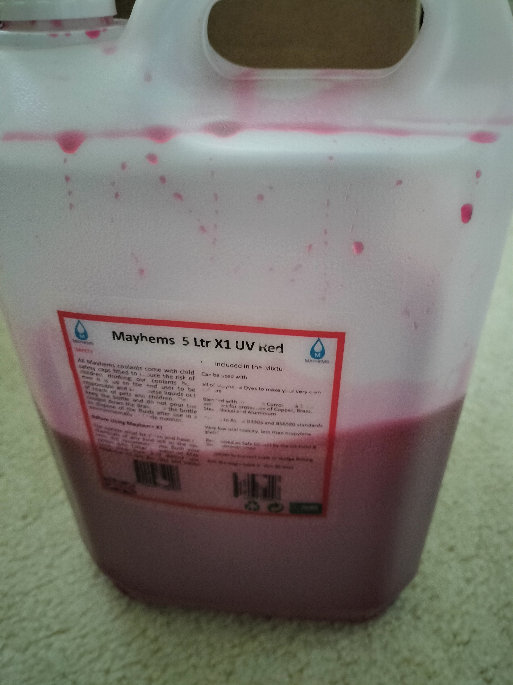
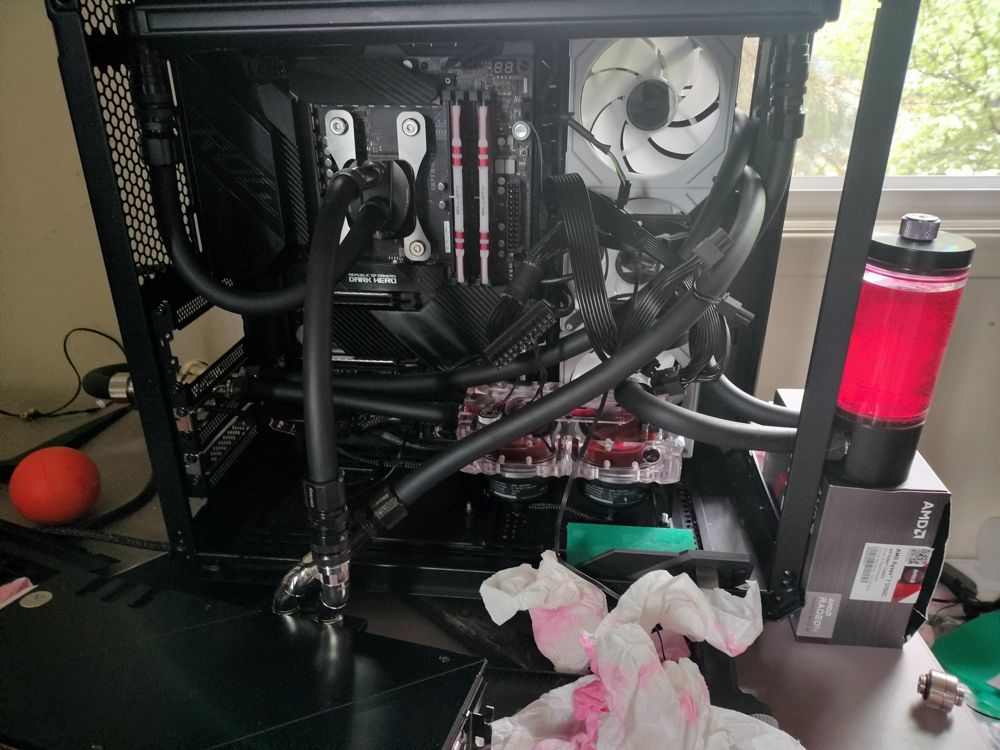
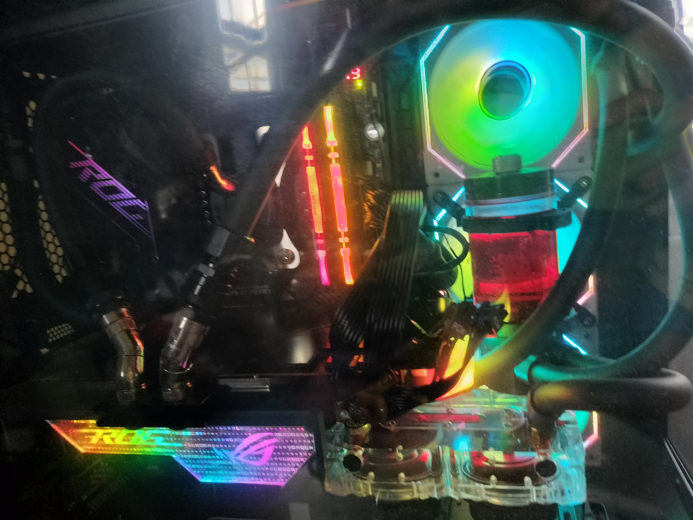
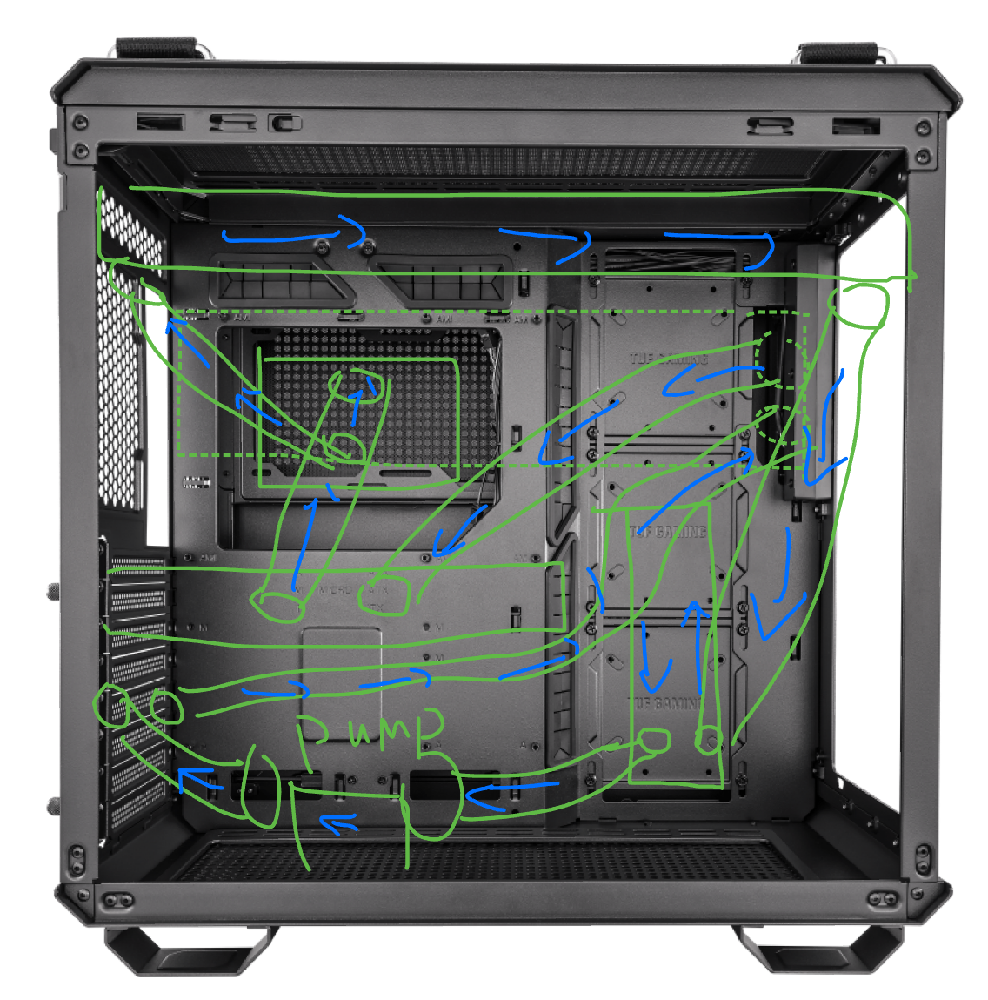
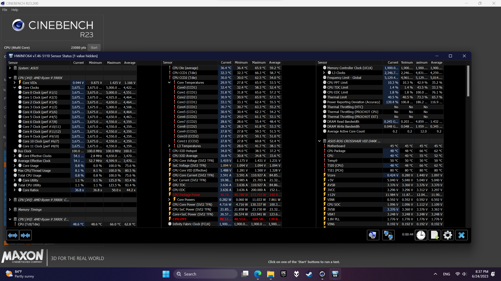
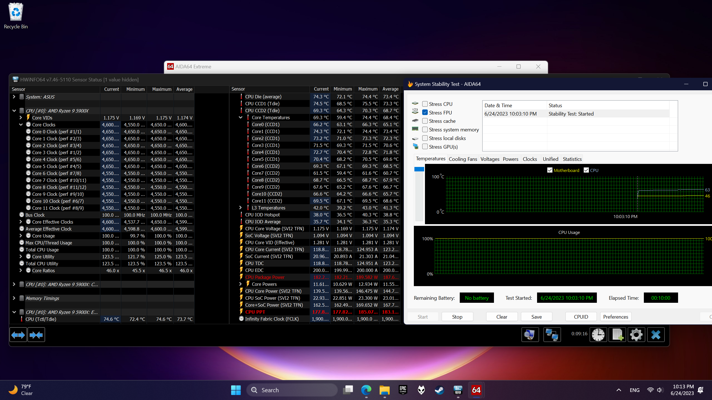
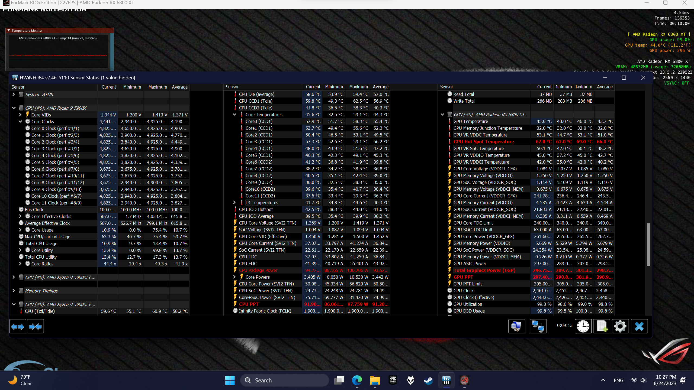

### 先简单开箱个全世界好评推荐的Mayhems X1冷液

是在PPCS买的，佛罗里达到密歇根走最便宜的UPS Ground也花了三天，包裹很普通，就是Mayhems的经典包装
打开之后像牛奶罐



这是已经加过水之后剩的，按照网友的说法这冷液两年一换都有点多余
别的地方也没啥特别的，感觉比我之前用的Koolance的702好闻些，沾到手上也比较好清理

### 进入正题

之前大奶机是仨D5（VPP655+2xVPP APEX）推360+1260，后来觉得A家七代的泵太吵了，把二奶机上换成了655，调最低一档带默频的5700G （只超了内存4000 C16+FCLK同步+核显2.3GHz)，除了震动是啥声也没有了，我滴世界终于清净了

由于没有多余的AM4冷头，加上之前其实买错了搞了普通版的冷头比较难受，就把那个拿给二奶机用了。盯着剩下的俩D5和之前买了妹装的Blackice GTS360，我陷入了沉思。
因为少了一个D5，推2x360 + 1260必然会降低流速，所以我这次构思水路的时候尽量选择少用/不用弯头。 在构思的时候参考了很多第八届机霸参赛选手以及别的502的分体方案，但是说实话，没见到几个用后置冷排支架的，更多的是用侧边。然而坑爹的就是黑冰自己的冷排比贼船的长了2毫米，然后侧边就塞不进去了。。。无语了。不过好在华硕的海景房有后置冷排支持，轻松安装。


比较乱但是我其实已经理过了，不然后排的风扇一直会打风扇线，好在用俩轧带固定了一下就没问题了


具体配置如下

```
CPU   AMD 5900X
主板   华硕 玩家国度 ROG Crosshair VIII Dark Hero
内存   镁光英睿达 铂胜 DDR4-3200 32Gx2
SSD   SK海力士 白金 P41 1TB + Intel P1600X 118GB + 西部数据 SN640 7.68TB
显卡   华硕 玩家国度 ROG 猛禽 6800 XT LC
机箱   华硕 TUF GT502 弹药箱 黑色
电源   海盗船 HX1000i 白金牌全模组电源
显卡支架 英特尔 DC P3600 + 华硕 玩家国度 ROG Herculx

水冷配件
CPU  Aquacomputer cuplex kryos NEXT AM4 / 3000, acetal / nickel
GPU  EKWB EK-Quantum Vector Strix RX 6800/6900 GPU Water Block, D-RGB, Nickel/Acetal
泵      Alphacool VPP Apex Pump x 2
盖  Alphacool Eisdecke Dual D5 Pump Top, Plexi
箱     Bitspower Water TanK Z-Multi Ultra 100 (POM Version)
快拧  Barrowch Compression Fitting Soft Tubing - Black
45° + 60°弯头 + QDC快插  Koolance 
内置排    Blackice GTS 360排 + X-flow
外置排    Alphacool NexXxoS XT45 Full Copper 1260mm SuperNova
排风扇   猫头鹰 A12x25 x5 + A20 x 4 + 联力 积木风扇 SL-INF 120 x 3
液  Mayhems X1 Coolant Premix, 5L, UV Red
管  EK-Tube ZMT Rubber 3/4" x 1/2" + 3/8" x 5/8"
接头 EK-Quantum Torque Extender Rotary MM 14 - Nickel
阀   Alphacool 2-Way Ball Valve G1/4 - Black Nickel
```


### 配置解析

内置冷排的选择了黑冰，因为其是公认的最强360薄排，外置的没有选择广受好评的MO-RA3（因为缺货）就选择了欧酷的1260超新星，纯铜45mm还是很强的，有人测过比MO-RA强一点。CPU冷头是坛友强推的Aquacomputer， 没有花里胡哨滴RGB，也没有亚克力，但是性能确实顶，加上这次下单的时候注意选了带偏移扣具版的（没错，猫头鹰和D大的冷头/散热器偏移扣具其实老早就有厂商在3000系的时候尝试了，目前看来效果很不错，具体测试后面会有。GPU的冷头选择就很有限了，之前入了个追风者的，热点和边缘不管怎么装和涂硅脂都有35度+的温差，非常恐怖，让我怀疑我这到底是不是水冷，果断回归EK（因为TitanRig 打折，只要47刀，自行车？）水泵是站长大大强推的APEX，确实很安静，串联泵盖加上20%最低转速也能带的动。水箱我是BP老用户了，第一次搞ITX分体就用的他家最小的50mm的Z-Multi，印象很好，又是最便宜的那一档，就果断搞了个100mm的（之前用过150mm，在弹药库里面有点太高不方便维护）。快拧BA不必多说，丑但好用的经典。 快插和弯头都是KL的，业内最好用没有之一。 风扇是猫头鹰和联力的无限静积木风扇，26%转速，不用多说，一个是安静一个是好看。 冷液就是前文简单开箱的Mayhems X1了。 最后水管用的EPDM，没有啥别的选择（缺货）所以就用的EK的ZMT。整套为了方便维护以及减少维护和不必要的放水，在CPU和GPU上分别用两套快插将水路分离（试水的时候显卡冷头螺丝妹拧紧漏了很烦但是清理起来是真方便）。上排也加了对快插（别的地方放不下了哈哈哈）。后排的水管特意留的比较长，方便拆卸的时候留足够的空间。

上几张祖传座机画质的图



试水，一开始没有注意到显卡漏了，还好一滴都没漏到PCB上，于是果断把显卡拉出来重新上紧了螺丝继续跑


擦电，揩鸡，轻松点亮！



装上玻璃侧板，没有撕膜，15mm的U2盘垫高显卡支架真好用哈哈


前脸，软管+无90度的暴力转弯，哈哈哈哈，依旧没有撕膜

### 水路解析

写本贴的时候才发现我精心设计的水流方向居然是反的。。。好在不影响性能；顺序是水箱->泵->外置排->后排->显卡->CPU->上排->回水箱



总计用了4个弯头（泵盖到水箱45°，CPU到显卡45+60，显卡到后排60），属实是看了水冷的秘密之后大受启发搞的。其实显卡和CPU上也可以不用弯头，无奈快插体积挺大，不用弯头基本上不可能

### 接下来日用最低噪音性能测试（D5 + A20 最低转速，A12 + SL-INF 660转）

*水温为泵盖出水口处。*



###### Cinebench R23

室温27，水温28，Cinebench R23跑了三轮，水温上升到29，CPU最高66度。170瓦的功耗，感觉在0噪音前提下是还可以了，锐龙还积热，没辙



###### AIDA64 FPU

单烤FPU十分钟，最高74度，190瓦功耗，水温31度。



###### Furmark 1440P

305W显卡（+100W CPU）单烤十分钟，边缘稳定在45度，最高来到46，热点则是67，最高69。水温35度，实测后排风口温度32度，外置冷排31度

懒得双烤了，就比烤Furmark多100瓦。

### 小结

从去年搞ssupd 2代分体到216再到弹药箱 ，从高中最后一年开始到高中毕业准备去上大学，我感觉很满足，终于可以摆脱温度焦虑和噪音了。感谢CHH的各位大佬的帮助，同时对被站长B站测评室拉黑感到抱歉，我不记得我评论了啥。总而言之，言而总之，这波我毕业了，这套配置再战五年不是问题。第一次写这么长，也算是记录一下一个菜鸡搞分体的过程。
