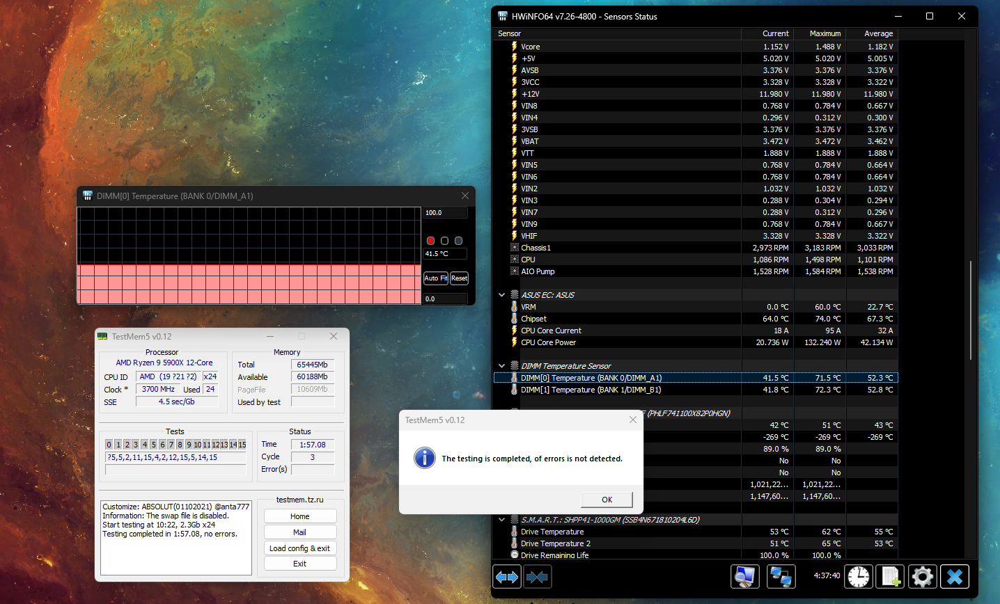
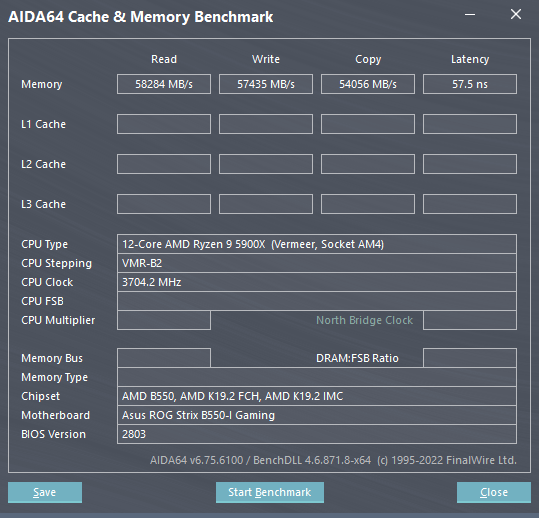

# About
After struggling with full CLANG LTO (Linker time optimization) using 32GB of RAM in early July, I decided to go all in for 64GB of RAM.
Since it has already been the end to DDR4 RAM, Crucial (mostly Micron) has decided to stop the production of the Ballistix line-up, therefore, it has already become nearly impossible to find any new kit under MSRP.
Luckily, after days of researching on eBay, I found someone who's willing to sell his for 260 bucks.
3200MHz, C16, 64GB, Micron B-die... I bet it has to be a good deal.

# OC result
It turns out it has been an awesome deal. Whereas, my CPU along with the ITX board is not good enough to keep it running at above-4000MHz.
To be more accurate, 3800MHz w/ 1900MHz FCLK is as far as it could reach.

|      | RAM OC | POST   | Stable |
| ---- | --------------- | -------- | -------- |
| 1    | 3200@C14             | :heavy_check_mark: | :heavy_multiplication_x: |
| 2    | 3600@C16             | :heavy_check_mark: | :heavy_check_mark:(stock) |
| 3    | **3800@C16**        | :heavy_check_mark: | :heavy_check_mark: |
| 4    | 4200@C20            | :heavy_check_mark: | :heavy_multiplication_x: (? Zen3 CPU IMC sucks!) |

Anyway, I'll update with more details. Right now, I have been running this OC configuration for like a month now, everything is looking solid.
It was even functioning well at 70 degrees Celsius, but Samsung's legendary B-die suffers from anything higher than 50.

Go! Micron B-die!

# Results

